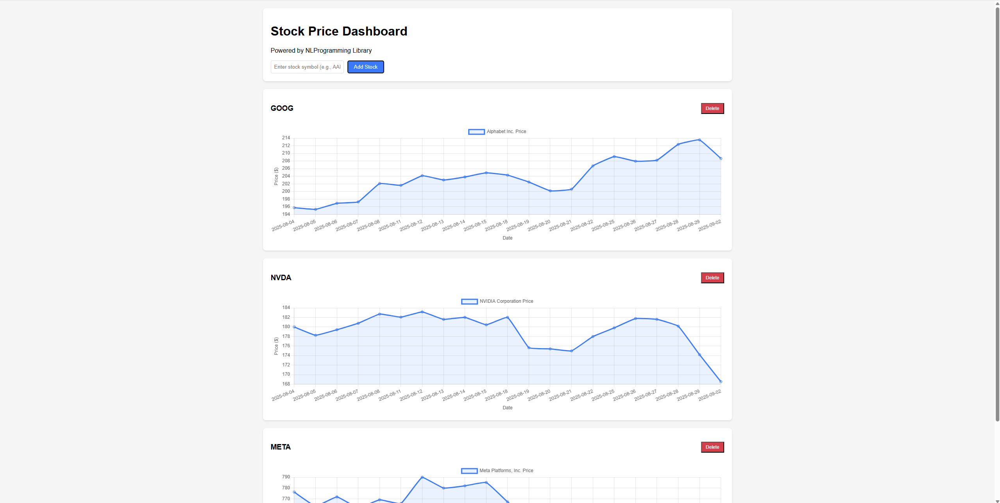

# Stock Price Dashboard Demo

This demo showcases the NLProgramming library through an interactive web application that displays real-time stock price charts.

## Preview



## Features

- See stock price for last 30 days.
- Add stock to the dashboard by symbol
- Remove stock from the dashboard

## How to Run

1. Set your API key as an environment variable:
   ```bash
   export LLM_API_KEY=your_api_key_here
   ```

2. Run the application:
   ```bash
   ./gradlew :demo:run
   ```

3. Open your browser and navigate to: `http://localhost:8080`
